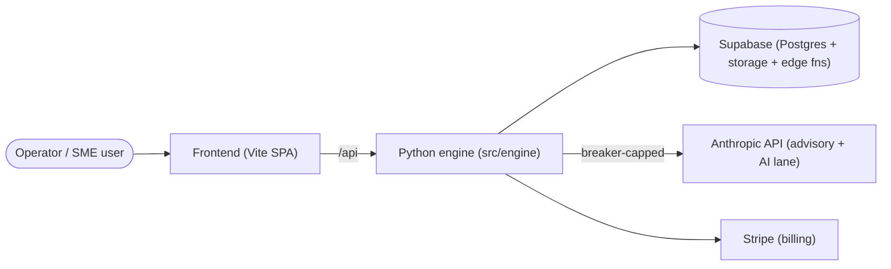
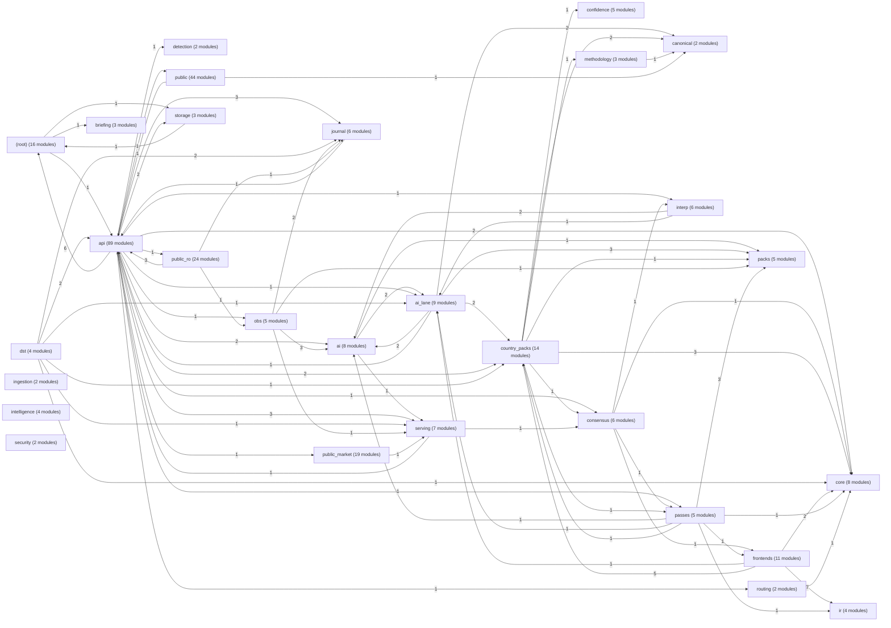

<!-- GENERATED by scripts/generate_engine_book.py — do not hand-edit.
     Regenerate with: python scripts/generate_engine_book.py
     Drift gate: tests/engine/test_engine_book.py (K8) -->

# Engine architecture (C4-style, derived from the import graph)

All package and module edges below are read from the actual `import`
statements in `src/engine` (ast-parsed, relative imports resolved).
If the code moves, this page regenerates differently and the K8 gate
fails until the committed book is regenerated.

## Level 1 — system context

## Level 2 — containers: packages of `src/engine`

Edge label = number of distinct modules in the source package that
import the target package.

## Level 3 — components: the value path, module level

Scope: `ai`, `canonical`, `frontends`, `ir`, `journal`, `passes`, `serving` packages plus `engine.api.pipeline` (the document
pipeline — `engine.pipeline` is the legacy SKU engine) and
`engine.api._reconcile`; edges are real imports inside that scope.

```mermaid
graph LR
    subgraph sg_ai["ai"]
        engine_ai["ai"]
        engine_ai_advisory["advisory"]
        engine_ai_breaker["breaker"]
        engine_ai_evals["evals"]
        engine_ai_evals_run_baseline["run_baseline"]
        engine_ai_numerals["numerals"]
        engine_ai_registry["registry"]
        engine_ai_unit_sanity["unit_sanity"]
    end
    subgraph sg_api["api"]
        engine_api__reconcile["_reconcile"]
        engine_api_pipeline["pipeline"]
    end
    subgraph sg_canonical["canonical"]
        engine_canonical["canonical"]
        engine_canonical_schema_v1["schema_v1"]
    end
    subgraph sg_frontends["frontends"]
        engine_frontends["frontends"]
        engine_frontends_csv_fe["csv_fe"]
        engine_frontends_generic4["generic4"]
        engine_frontends_legacy_adapter["legacy_adapter"]
        engine_frontends_llm_extractor["llm_extractor"]
        engine_frontends_map_guided["map_guided"]
        engine_frontends_map_guided_legacy["map_guided_legacy"]
        engine_frontends_positional_pdf["positional_pdf"]
        engine_frontends_registry["registry"]
        engine_frontends_saga10["saga10"]
        engine_frontends_saga6["saga6"]
    end
    subgraph sg_ir["ir"]
        engine_ir["ir"]
        engine_ir_ledgerdoc["ledgerdoc"]
        engine_ir_money["money"]
        engine_ir_schema["schema"]
    end
    subgraph sg_journal["journal"]
        engine_journal["journal"]
        engine_journal_events["events"]
        engine_journal_hooks["hooks"]
        engine_journal_journal["journal"]
        engine_journal_resume["resume"]
        engine_journal_store["store"]
    end
    subgraph sg_passes["passes"]
        engine_passes["passes"]
        engine_passes_classify["classify"]
        engine_passes_movement_review["movement_review"]
        engine_passes_movements["movements"]
        engine_passes_shadow["shadow"]
    end
    subgraph sg_serving["serving"]
        engine_serving["serving"]
        engine_serving__internal_guard["_internal_guard"]
        engine_serving_access_log["access_log"]
        engine_serving_facts["facts"]
        engine_serving_public_market["public_market"]
        engine_serving_public_summary["public_summary"]
        engine_serving_status["status"]
    end
    engine_ai --> engine_ai_registry
    engine_ai_advisory --> engine_ai
    engine_ai_advisory --> engine_ai_breaker
    engine_ai_advisory --> engine_ai_registry
    engine_ai_advisory --> engine_serving
    engine_ai_breaker --> engine_ai
    engine_ai_breaker --> engine_ai_registry
    engine_ai_evals_run_baseline --> engine_ai
    engine_ai_evals_run_baseline --> engine_ai_advisory
    engine_ai_evals_run_baseline --> engine_ai_registry
    engine_api__reconcile --> engine_ai
    engine_api__reconcile --> engine_ai_registry
    engine_api__reconcile --> engine_serving
    engine_api_pipeline --> engine_ai
    engine_api_pipeline --> engine_ai_advisory
    engine_api_pipeline --> engine_ai_numerals
    engine_api_pipeline --> engine_ai_registry
    engine_api_pipeline --> engine_ai_unit_sanity
    engine_api_pipeline --> engine_api__reconcile
    engine_api_pipeline --> engine_journal
    engine_api_pipeline --> engine_journal_hooks
    engine_api_pipeline --> engine_passes_shadow
    engine_api_pipeline --> engine_serving_facts
    engine_canonical --> engine_canonical_schema_v1
    engine_frontends --> engine_frontends_csv_fe
    engine_frontends --> engine_frontends_generic4
    engine_frontends --> engine_frontends_legacy_adapter
    engine_frontends --> engine_frontends_llm_extractor
    engine_frontends --> engine_frontends_positional_pdf
    engine_frontends --> engine_frontends_registry
    engine_frontends --> engine_frontends_saga10
    engine_frontends --> engine_frontends_saga6
    engine_frontends_csv_fe --> engine_frontends_saga10
    engine_frontends_generic4 --> engine_frontends_saga10
    engine_frontends_legacy_adapter --> engine_frontends_llm_extractor
    engine_frontends_legacy_adapter --> engine_frontends_map_guided
    engine_frontends_legacy_adapter --> engine_frontends_map_guided_legacy
    engine_frontends_legacy_adapter --> engine_frontends_saga10
    engine_frontends_legacy_adapter --> engine_ir
    engine_frontends_llm_extractor --> engine_frontends_saga10
    engine_frontends_llm_extractor --> engine_ir
    engine_frontends_map_guided --> engine_frontends_saga10
    engine_frontends_map_guided --> engine_ir
    engine_frontends_map_guided_legacy --> engine_frontends
    engine_frontends_map_guided_legacy --> engine_frontends_legacy_adapter
    engine_frontends_map_guided_legacy --> engine_frontends_map_guided
    engine_frontends_map_guided_legacy --> engine_frontends_saga10
    engine_frontends_map_guided_legacy --> engine_ir
    engine_frontends_positional_pdf --> engine_frontends_saga10
    engine_frontends_positional_pdf --> engine_ir
    engine_frontends_registry --> engine_frontends_csv_fe
    engine_frontends_registry --> engine_frontends_generic4
    engine_frontends_registry --> engine_frontends_llm_extractor
    engine_frontends_registry --> engine_frontends_map_guided
    engine_frontends_registry --> engine_frontends_positional_pdf
    engine_frontends_registry --> engine_frontends_saga10
    engine_frontends_registry --> engine_frontends_saga6
    engine_frontends_registry --> engine_ir
    engine_frontends_saga10 --> engine_ir
    engine_frontends_saga6 --> engine_frontends_saga10
    engine_ir --> engine_ir_ledgerdoc
    engine_ir --> engine_ir_money
    engine_ir --> engine_ir_schema
    engine_ir_ledgerdoc --> engine_ir_money
    engine_ir_schema --> engine_ir_ledgerdoc
    engine_ir_schema --> engine_ir_money
    engine_journal --> engine_journal_events
    engine_journal --> engine_journal_journal
    engine_journal --> engine_journal_resume
    engine_journal --> engine_journal_store
    engine_journal_hooks --> engine_journal_events
    engine_journal_hooks --> engine_journal_journal
    engine_journal_journal --> engine_journal_events
    engine_journal_journal --> engine_journal_store
    engine_journal_resume --> engine_api_pipeline
    engine_journal_resume --> engine_journal
    engine_journal_resume --> engine_journal_hooks
    engine_journal_resume --> engine_journal_journal
    engine_journal_store --> engine_journal_events
    engine_passes --> engine_passes_classify
    engine_passes_classify --> engine_ir
    engine_passes_movement_review --> engine_ai
    engine_passes_movement_review --> engine_ai_breaker
    engine_passes_shadow --> engine_frontends_registry
    engine_passes_shadow --> engine_frontends_saga10
    engine_passes_shadow --> engine_passes_classify
    engine_serving --> engine_serving_facts
    engine_serving --> engine_serving_public_market
    engine_serving --> engine_serving_public_summary
    engine_serving --> engine_serving_status
    engine_serving_facts --> engine_api__reconcile
    engine_serving_facts --> engine_serving
    engine_serving_facts --> engine_serving_access_log
```

## Declared third-party imports per package

Import sites of dependencies declared in `pyproject.toml` (the
2026-08-22 httpx incident class: an import here without a matching
declaration is the supply-chain lock's job to reject).

| package | third-party imports (declared dist) |
|---|---|
| `(root)` | anthropic (anthropic), pandas (pandas), pydantic (pydantic), uvicorn (uvicorn), yaml (pyyaml) |
| `ai` | yaml (pyyaml) |
| `ai_lane` | anthropic (anthropic), fastapi (fastapi), openpyxl (openpyxl) |
| `api` | anthropic (anthropic), fastapi (fastapi), httpx (httpx), openai (openai), openpyxl (openpyxl), pandas (pandas), pdfplumber (pdfplumber), pydantic (pydantic), sqlalchemy (sqlalchemy), stripe (stripe), xlrd (xlrd), yaml (pyyaml) |
| `briefing` | anthropic (anthropic) |
| `country_packs` | fitz (pymupdf), openpyxl (openpyxl), pandas (pandas) |
| `frontends` | pandas (pandas) |
| `intelligence` | pandas (pandas) |
| `interp` | openpyxl (openpyxl), pandas (pandas) |
| `methodology` | yaml (pyyaml) |
| `packs` | yaml (pyyaml) |
| `public` | anthropic (anthropic), fastapi (fastapi), httpx (httpx), pydantic (pydantic) |
| `public_market` | anthropic (anthropic), fastapi (fastapi), yaml (pyyaml) |
| `public_ro` | fastapi (fastapi), pydantic (pydantic) |
| `storage` | pandas (pandas), sqlalchemy (sqlalchemy) |
