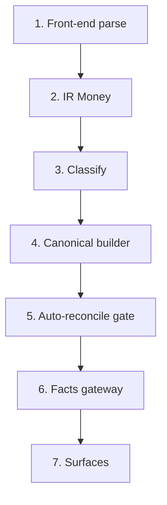

<!-- GENERATED by scripts/generate_engine_book.py — do not hand-edit.
     Regenerate with: python scripts/generate_engine_book.py
     Drift gate: tests/engine/test_engine_book.py (K8) -->

# The money path — one cent, cell to statement

Each step names the module that carries the cent and the invariant
ids guarding it (each id resolves in [invariants.md](invariants.md);
assert ids are re-read from the named modules at generation time, so
a moved assert or module fails the K8 gate).

## 1. Front-end parse — the cell becomes an atom with a source_ref

A registered front-end (saga6/saga10/generic4/csv/positional-pdf/llm-extractor via `frontends/registry.py`) reads the uploaded file and emits IR atoms; every amount carries a `source_ref` (sheet/row/col provenance, serialized in `ir/schema.py`) so the cent stays traceable to its exact cell.

| module | always-on asserts found here |
|---|---|
| `src/engine/frontends` | — |
| `src/engine/ir/schema.py` | — |

Guarding invariants: `N1`, `N2`, `M5`

## 2. IR Money — exact integer minor units, one unit per algebra

The amount is frozen as `Money` (exact int minor units — floats never enter the algebra) inside an immutable `LedgerDoc`; ABSENT and ZERO stay distinct.

| module | always-on asserts found here |
|---|---|
| `src/engine/ir/money.py` | `A-001`, `A-002`, `A-003`, `A-004`, `A-005` |
| `src/engine/ir/ledgerdoc.py` | `A-010`, `A-011`, `A-012`, `A-013` |

Guarding invariants: `N5`, `N6`

## 3. Classify — the atom gets a rule id from the jurisdiction pack

`passes/classify.py` assigns each atom a statement line via the pinned, effective-dated rules pack (classified-or-unclassified, never guessed, never dropped).

| module | always-on asserts found here |
|---|---|
| `src/engine/passes/classify.py` | `A-020`, `A-021`, `A-022`, `A-023`, `A-024`, `A-025`, `A-026` |
| `src/engine/packs` | — |

Guarding invariants: `N3`, `N7`

## 4. Canonical builder — partitioned into the closing identity

The pack's canonical adapter partitions every signed closing balance onto exactly one statement side; row/total partition asserts hold to the cent and unmapped value is included + flagged, never dropped.

| module | always-on asserts found here |
|---|---|
| `src/engine/country_packs/ro_romania/canonical_adapter.py` | `A-030`, `A-031`, `A-032`, `A-033`, `A-034`, `A-035`, `A-036` |

Guarding invariants: `I2`, `P1`, `P3`, `D8_OMITTED`, `D9_UNMAPPED_INCLUDED`

## 5. Auto-reconcile gate — diagnose, propose, adjust additively

A non-balanced envelope gets a deterministic diagnosis (D-codes) and reversible proposals (R-codes); sub-threshold drift is auto-fixed at persist, always additively — source cents are never rewritten and RECONCILED is never dressed up as BALANCED.

| module | always-on asserts found here |
|---|---|
| `src/engine/api/_reconcile.py` | — |
| `src/engine/confidence/reconciliation_checks.py` | — |

Guarding invariants: `P2`, `P4`, `P5`, `P9`, `M1`

## 6. Facts gateway — the ONE typed reader of served truth

`FactsGateway` serves adjusted figures while raw accessors keep the untouched source cents; `present_status` owns every status display. `scripts/check_import_boundary.py` keeps all other code out of the raw snapshot.

| module | always-on asserts found here |
|---|---|
| `src/engine/serving/facts.py` | — |
| `src/engine/serving/status.py` | — |

Guarding invariants: `I2`, `I3`, `I4`

## 7. Surfaces — pipeline persist/serve, journaled

`api/pipeline.py` persists the envelope (additive-only contract) and the journal hash-chains every stage boundary, so the served cent is replayable, resumable and as-of addressable.

| module | always-on asserts found here |
|---|---|
| `src/engine/api/pipeline.py` | — |
| `src/engine/journal` | — |

Guarding invariants: `K1`, `K2`, `P6`, `P8`, `V1`
